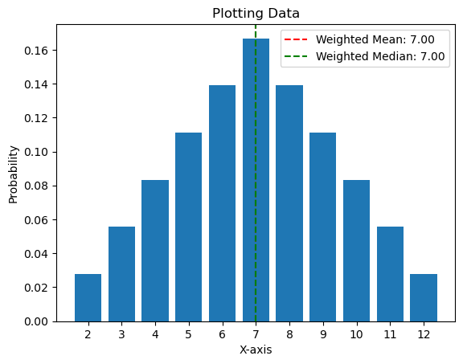
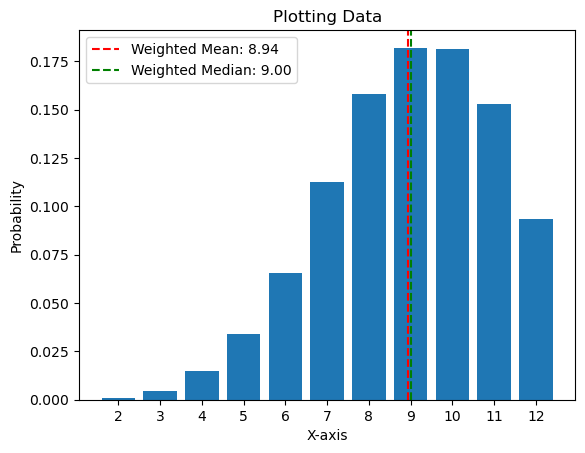

Ever wanted to know, how much *Savage Attacker* increases your dice rolling outcome on average? \
How does 2d6 compare to 1d12?\
Whats the average when rolling 20d4?

With this repo, you can calculate such things.

```
Board_Statistics() \
    .add_die(FairDie(6)) \
    .add_die(FairDie(6)) \
    .plot()
```


```
Board_Statistics() \
    .add_highest([FairDie(6),FairDie(6)]) \
    .add_highest([FairDie(6),FairDie(6)]) \
    .plot()
```
